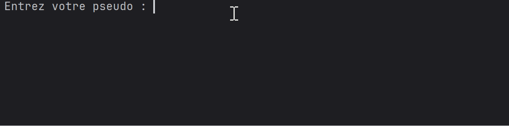

<h1 align="center">Chat UDP</h1>

---

## Table des matières
- [Description du projet](#description-du-projet)
- [Technologies utilisées](#technologies-utilisées)
- [Auteures](#auteures)
- [Progression du projet](#progression-du-projet)

---

## Description du projet

Cette application implémente un **chat basé sur le protocole UDP**, suivant une architecture **client–serveur**.

Le projet a été réalisé dans un contexte **académique** (1ère année), dans le but de :
- comprendre le fonctionnement des **communications réseau bas niveau**
- manipuler le protocole **UDP** et ses contraintes
- mettre en place une gestion multi-clients côté serveur

Les utilisateurs peuvent s’inscrire avec un **pseudonyme unique**, envoyer des **messages publics ou privés** et interagir avec le serveur via des **commandes textuelles**.

**Fonctionnalités principales :**
- Inscription avec vérification d’un pseudonyme unique
- Messagerie publique
- Messagerie privée entre utilisateurs
- Affichage de la liste des utilisateurs connectés
- Commandes de gestion du client

/!\ Le projet met volontairement l’accent sur la **logique réseau** plutôt que sur la persistance ou l’interface graphique.

---

## Technologies utilisées

| Technologie | Détails |
|------------|--------|
| **Langage** | Java |
| **Outils** | Git, GitHub, IntelliJ IDEA |

---

> Projet en ligne de commande : aucune interface graphique n’est utilisée.

---

## Auteures

- **Chafae Qallouj**  
  Étudiante en école d’ingénieur informatique  
  🔗 [GitHub](https://github.com/QALLOUJ)  

- **Ashley Padayodi**  
  Étudiante en école d’ingénieur informatique  
  🔗 [GitHub](https://github.com/ednashley)  

---

## Progression du projet

**Statut : Terminé**

### Fonctionnalités implémentées
- Inscription des clients via UDP
- Gestion des pseudonymes uniques
- Envoi de messages publics
- Envoi de messages privés (`@pseudo message`)
- Commandes :
  - `/list` : afficher les utilisateurs connectés
  - `/help` : afficher l’aide
  - `/quit` : quitter le chat

### Limitations actuelles
- Pas d’historique des messages
- UDP non fiable (perte possible de messages)
- Pas de chiffrement
- Interface uniquement en ligne de commande

### Améliorations possibles
- Ajout d’un accusé de réception des messages
- Gestion d’un historique côté serveur
- Interface graphique
- Passage à TCP pour comparaison des protocoles
- Authentification plus avancée

👉 Les retours et suggestions sont les bienvenus.
